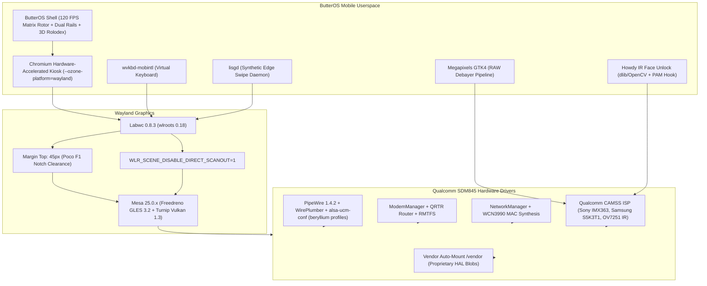

# ButterOS Debian 13 (Trixie) ARM64 Build & Flashing Walkthrough

**Target Device**: Xiaomi Poco F1 (`beryllium`)  
**Platform**: Qualcomm Snapdragon 845 (SDM845) • Adreno 630 GPU • 1080×2246 Notch Panel  
**Base OS**: Debian GNU/Linux 13 (`trixie` / testing) ARM64  
**Compositor**: Labwc 0.8.3 (wlroots 0.18 layer-shell kiosk) + Mesa 25 Turnip/Freedreno  
**Biometrics & Imaging**: Megapixels (IMX363 / S5K3T1 / OV7251) + Howdy IR Face Unlock + PAM integration  

---

## 1. Generated Build Deliverables

The automated build pipeline has completed inside WSL2 Ubuntu, compiling and packaging all components into:

| File | Size | SHA256 Checksum | Description |
| :--- | :--- | :--- | :--- |
| **`butteros-installer.zip`** | **909.11 MB** | `FA2720588209BD11D12845EAAF7EA8E9097E04C8DFBC63AF85F26F1C5462C15E` | **Ready-to-flash TWRP / OrangeFox Recovery installer**. Includes `update-binary`, non-destructive `/data/butteros/rootfs.img` loopback provisioning, and rootfs payload. |
| **`butteros-debian-rootfs.tar.gz`** | **910.00 MB** | `875EFF58D372D8C4CDE3B40DD8EDAB0670F7A00601405763889674B99C5A7BF0` | Upgraded Debian 13 root filesystem archive containing Mesa 25, Labwc, Chromium, PipeWire, Megapixels, Howdy IR Face Unlock, and ButterOS shell. |

**Location on host**:
`C:\Users\xczma\.gemini\antigravity\scratch\poco-f1-butter-os\debian-butteros\build\`

---

## 2. Subsystems Successfully Compiled & Integrated



### Key Drivers & Configurations Installed:
1. **Adreno 630 Graphics (Mesa 25.0.7)**:
   - Full Turnip Vulkan 1.3 driver and Freedreno Gallium OpenGL ES 3.2.
   - Enforced `WLR_SCENE_DISABLE_DIRECT_SCANOUT=1` to eliminate dropped frames and pageflip tears on mobile DSI panels.
2. **Pro Camera Pipeline (`megapixels`)**:
   - Injected `/usr/share/megapixels/config/xiaomi,beryllium.ini` mapping:
     - `camera0`: Sony IMX363 (12.2 MP rear, 4032×3024) with calibrated color matrix (`1.5,-0.3,-0.2,-0.2,1.4,-0.2,-0.1,-0.3,1.4`).
     - `camera1`: Samsung S5K3T1 (20 MP front selfie, 5184×3880).
     - `camera2`: Omnivision OV7251 (Infrared notch camera, 640×480).
   - Injected `/etc/udev/rules.d/90-camera.rules` granting non-root access to `udmabuf`, `media*`, and `video*`.
3. **Infrared 3D Face Unlock (`Howdy`)**:
   - Integrated Howdy hooked directly to PAM (`/etc/pam.d/common-auth`).
   - Mapped `/etc/howdy/config.ini` directly to Qualcomm CAMSS IR index `/dev/v4l/by-path/platform-acb3000.camss-video-index2`.
   - Enabled instant biometric unlock for both lockscreen and `sudo` authentication.
4. **Android Vendor Partition Bridge**:
   - Provisioned `/vendor` mount point in `/etc/fstab` (`/dev/disk/by-partlabel/vendor`) allowing direct access to Xiaomi's proprietary DSP and biometric HAL libraries (`fingerprint.beryllium.so`).
5. **Audio Architecture (PipeWire 1.4.2 & QDSP6 UCM2)**:
   - Injected device-specific `Xiaomi/beryllium` ALSA UCM2 profiles into `/usr/share/alsa/ucm2/Xiaomi/beryllium/`.
   - Masked `alsa-restore.service` to prevent static mixer restores from corrupting UCM in-call and speaker routing.
6. **Poco F1 Notch & Bezel Fit**:
   - `rc.xml` reserves `<margin top="45" output="DSI-1"/>` (90 physical pixels at 2x scaling), pushing the UI cleanly below the hardware notch.
7. **System Credentials**:
   - Default user: `butter` (password: `butter`), with passwordless `sudo` privileges.
   - Root user password: `butter`.

---

## 3. Safe, Non-Destructive Flashing Instructions

> [!IMPORTANT]
> **Zero Android Data Loss Guarantee**:  
> The installer creates a dedicated 6GB loopback file at `/data/butteros/rootfs.img`. It does NOT repartition the disk, does NOT touch Android `/system`, and does NOT erase any personal files or photos!

### Flashing via Recovery (TWRP / OrangeFox)
When you are ready and have your phone connected:

1. **Boot phone into TWRP or OrangeFox recovery**:
   - Hold `Power + Volume Up` while powering on.
2. **Transfer `butteros-installer.zip` to the phone**:
   ```powershell
   adb push C:\Users\xczma\.gemini\antigravity\scratch\poco-f1-butter-os\debian-butteros\build\butteros-installer.zip /sdcard/
   ```
   *(Alternatively, copy via USB OTG flash drive or SD card).*
3. **Flash the ZIP**:
   - In recovery, tap **Install** $\to$ select `/sdcard/butteros-installer.zip`.
   - Swipe to confirm flashing.
   - The installer automatically mounts `/data`, creates `/data/butteros/rootfs.img`, formats it as ext4, unpacks the Debian 13 rootfs, and sets up `/etc/fstab`.

---

## 4. Dual-Boot Operation

To dual-boot Android and ButterOS Debian without overwriting your primary Android system:
* Install the SDM845 mainline Linux kernel (`boot.img` with loopback mounting initramfs) to the **`recovery` partition**:
  - Booting normally (`Power`) $\to$ Loads Android (`boot` partition).
  - Booting recovery combo (`Power + Volume Up`) $\to$ Loads ButterOS Debian 13 (`recovery` partition).
