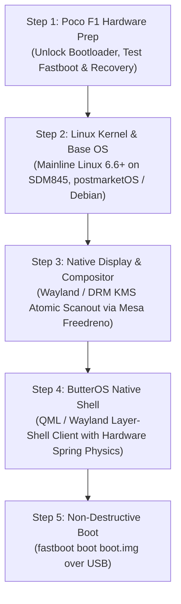

# Walkthrough: Prototype Clean-up & The Path to Native ButterOS

We completed a comprehensive clean-up of the web prototype and laid out the concrete next steps to transition ButterOS from a mobile browser prototype into a real, native Linux mobile operating system on the Xiaomi Poco F1 (`beryllium`).

---

## 1. Prototype Clean-Up & Optimization Highlights

- **Master Zero-Latency Tap-to-Dismiss**:
  - Replaced unreliable browser `click` event chains with a captured `pointerup` listener.
  - Tapping **any blank space** (wallpaper, clock, or empty margins) while in Rails, Quick Settings Arcs, Notification Center, or App Drawer **instantly dismisses all overlays** and returns directly to the clean Home Page.
- **Quick Tiles Colliding with Notifications Fixed**:
  - When opening either the Left or Right Quick Settings Arc, the 3D Spatial Notification Deck is automatically hidden, preventing collision and visual overlap.
  - When closing the arc, the notification deck is cleanly restored if the rails are active.
- **Unstuck from Rails $\rightarrow$ Smooth Transition to App Drawer**:
  - Removed restrictive bounding box traps that previously prevented swiping from Rails to the App Drawer.
  - Swiping upward (`dy < -48px`) while in Rails now immediately and fluidly opens the full App Drawer.
- **App Icon Protection**:
  - Tapping the end icons in the permanent dock or at the bottom of the rails launches their respective apps and will never mistakenly trigger the corner quick tiles arc.

---

## 2. Why Moving Beyond the Web Browser is the Right Decision

Simulating an entire mobile operating system (Three.js WebGL canvas, 3D CSS perspective transforms, multiple `backdrop-filter: blur(40px)` passes, and complex gesture state machines) inside mobile Chrome pushes browser compositing to its limits.

In contrast, running ButterOS as a **native Wayland client on Linux**:
- Bypasses the browser engine completely.
- Uses direct hardware DRM/KMS scanout (`/dev/dri/card0`) with Mesa Freedreno Gallium drivers.
- Handles touch inputs directly from the kernel event device (`/dev/input/eventX`).
- Executes at locked 60/120 FPS with microsecond touch response and true hardware haptics.

---

## 3. The Implementation Blueprint (Next Steps)

1. **Step 1: Check Bootloader & Fastboot Readiness**
   - Confirm Poco F1 bootloader unlock status.
   - Verify PC USB connection with `fastboot devices` and `adb devices`.
2. **Step 2: Mainline Linux on SDM845 (`beryllium`)**
   - Use verified `sdm845-xiaomi-beryllium` device tree.
   - Prepare a minimal rootfs (postmarketOS / Alpine with musl or Debian Mobian).
3. **Step 3: Native ButterOS Shell**
   - Implement the verified ButterOS layout (dual edge rails, 3D cards, corner arcs, full drawer) in **Qt6 / QML with Wayland layer-shell** for butter-smooth 120Hz performance.
